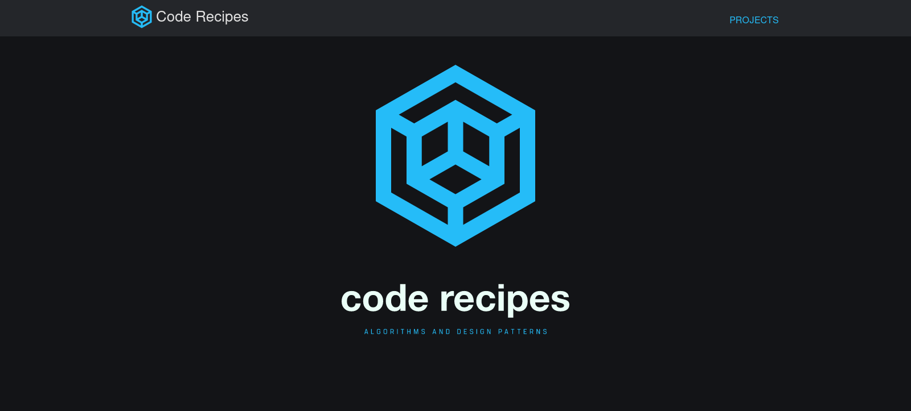

# Code Recipes



Code Recipes is an interactive and visual website for learning, implementing, and sharing algorithms and design patterns. Our goal is to centralize most programming algorithms in one place, so that anyone can implement and rate them.

## Features
### Projects page

presents a grid of algorithm images, sorted by views, name, and description. Users can also organize, filter by tags, and search for these algorithms.

### Algorithm Page

When clicking on an algorithm, users will be directed to its page. Here, they can find the algorithm's information, such as description, use cases, and external references. The main functionality of this page is the interactive window that shows the algorithm in execution and, below it, the steps for implementation and the code.

### Unit Tests
Each comoponent has an unity test

## Technologies
  - React for components
  - Next.js for static site generation
  - Typescript as language
  - MongoDB as database
  - Cypress for tests

## Contribution

This project is open-source and we are always looking for contributions from the developer community. If you want to contribute, feel free to send pull requests and report issues.

## Deployment

- Go to Vercel, import project and deploy
- Set the enviroment MONGODB_URI to your mongodb cluster URI
- Create a new database called "CodeRecipes
- Create a new collection inside CodeRecipes called "Projects"
- You can insert your projects here with the format:

```json
{ 
  "name" : "string",
  "description" : "string",
  "imageURL" : "string",
  "code" : "string",
  "useCases" : ["string"],
  "implementationSteps" : ["string"],
  "tags" : ["Algorithm", "Template", "Design Pattern"]
}
```


## License

This project is licensed under the MIT License - see the LICENSE.md file for more details.
